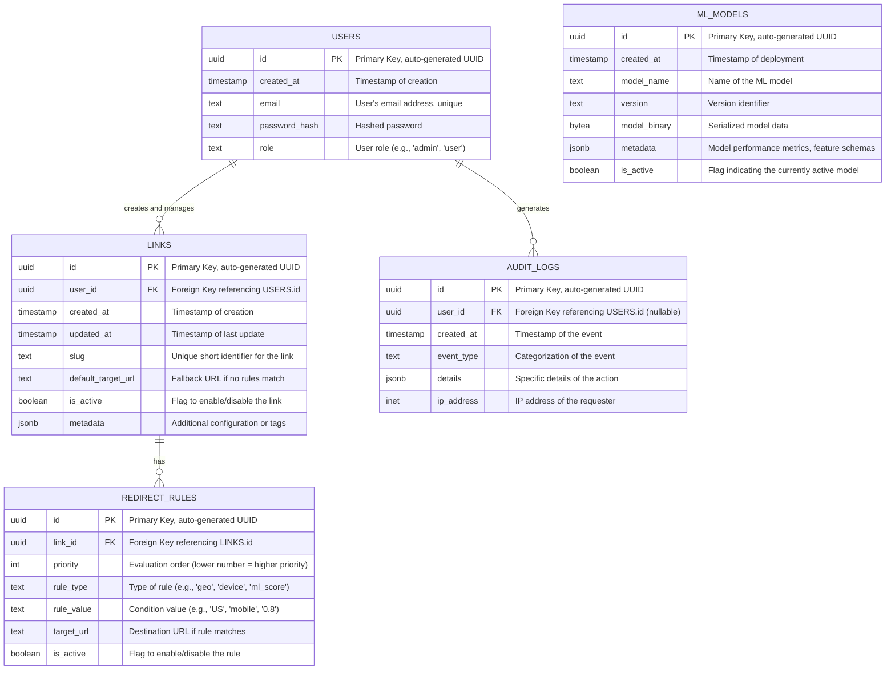

# Database Schema Document for Secure, Compliance-Shielded Link Routing SaaS Platform

## 1. Introduction

This document details the database schema for the secure, compliance-shielded link routing SaaS platform. The database is hosted on Supabase (PostgreSQL) and is designed to support high-performance routing lookups, secure user management, and comprehensive audit logging. The schema incorporates Row-Level Security (RLS) to ensure data isolation and compliance with privacy regulations.

## 2. Entity-Relationship Diagram (ERD)



## 3. Table Definitions (DDL)

The following SQL statements define the tables, constraints, and Row-Level Security (RLS) policies.

### 3.1. `users` Table

Stores user account information and roles.

```sql
CREATE TABLE public.users (
    id uuid PRIMARY KEY DEFAULT uuid_generate_v4(),
    created_at timestamp with time zone DEFAULT now() NOT NULL,
    email text UNIQUE NOT NULL,
    password_hash text NOT NULL,
    role text DEFAULT 'user'::text NOT NULL
);

-- RLS Policies
ALTER TABLE public.users ENABLE ROW LEVEL SECURITY;

-- Users can read their own profile
CREATE POLICY "Users can view their own user data." 
ON public.users FOR SELECT 
USING (auth.uid() = id);

-- Users can update their own profile (e.g., change password)
CREATE POLICY "Users can update their own user data." 
ON public.users FOR UPDATE 
USING (auth.uid() = id);
```

### 3.2. `links` Table

Stores the core configuration for each routing link.

```sql
CREATE TABLE public.links (
    id uuid PRIMARY KEY DEFAULT uuid_generate_v4(),
    user_id uuid REFERENCES public.users(id) ON DELETE CASCADE NOT NULL,
    created_at timestamp with time zone DEFAULT now() NOT NULL,
    updated_at timestamp with time zone DEFAULT now() NOT NULL,
    slug text UNIQUE NOT NULL,
    default_target_url text NOT NULL,
    is_active boolean DEFAULT true NOT NULL,
    metadata jsonb DEFAULT '{}'::jsonb NOT NULL
);

-- Indexes for performance
CREATE INDEX idx_links_user_id ON public.links(user_id);
CREATE INDEX idx_links_slug ON public.links(slug);

-- RLS Policies
ALTER TABLE public.links ENABLE ROW LEVEL SECURITY;

-- Users have full CRUD access to their own links
CREATE POLICY "Users can manage their own links." 
ON public.links FOR ALL 
USING (auth.uid() = user_id);
```

### 3.3. `redirect_rules` Table

Stores the conditional routing logic associated with specific links.

```sql
CREATE TABLE public.redirect_rules (
    id uuid PRIMARY KEY DEFAULT uuid_generate_v4(),
    link_id uuid REFERENCES public.links(id) ON DELETE CASCADE NOT NULL,
    priority integer NOT NULL,
    rule_type text NOT NULL, 
    rule_value text NOT NULL, 
    target_url text NOT NULL,
    is_active boolean DEFAULT true NOT NULL
);

-- Indexes for performance
CREATE INDEX idx_redirect_rules_link_id ON public.redirect_rules(link_id);

-- RLS Policies
ALTER TABLE public.redirect_rules ENABLE ROW LEVEL SECURITY;

-- Users can manage rules for links they own
CREATE POLICY "Users can manage redirect rules for their links." 
ON public.redirect_rules FOR ALL 
USING (
    EXISTS (
        SELECT 1 FROM public.links 
        WHERE links.id = redirect_rules.link_id 
        AND links.user_id = auth.uid()
    )
);
```

### 3.4. `ml_models` Table

Stores metadata and serialized binaries for the Machine Learning traffic classification models.

```sql
CREATE TABLE public.ml_models (
    id uuid PRIMARY KEY DEFAULT uuid_generate_v4(),
    created_at timestamp with time zone DEFAULT now() NOT NULL,
    model_name text NOT NULL,
    version text NOT NULL,
    model_binary bytea NOT NULL,
    metadata jsonb DEFAULT '{}'::jsonb NOT NULL,
    is_active boolean DEFAULT false NOT NULL
);

-- Ensure only one model is active at a time (can be enforced via application logic or a more complex constraint)
CREATE UNIQUE INDEX idx_ml_models_active ON public.ml_models(is_active) WHERE is_active = true;

-- RLS Policies
ALTER TABLE public.ml_models ENABLE ROW LEVEL SECURITY;

-- Only administrators can manage ML models
CREATE POLICY "Admins can manage ML models." 
ON public.ml_models FOR ALL 
USING (
    EXISTS (
        SELECT 1 FROM public.users 
        WHERE users.id = auth.uid() 
        AND users.role = 'admin'
    )
);

-- Edge functions (which might run with a specific service role) need read access
CREATE POLICY "Service role can read active ML model."
ON public.ml_models FOR SELECT
USING (is_active = true);
```

### 3.5. `audit_logs` Table

Stores a tamper-evident record of administrative and security-sensitive actions.

```sql
CREATE TABLE public.audit_logs (
    id uuid PRIMARY KEY DEFAULT uuid_generate_v4(),
    user_id uuid REFERENCES public.users(id) ON DELETE SET NULL,
    created_at timestamp with time zone DEFAULT now() NOT NULL,
    event_type text NOT NULL,
    details jsonb DEFAULT '{}'::jsonb NOT NULL,
    ip_address inet
);

-- Indexes for performance (e.g., searching logs by user or date)
CREATE INDEX idx_audit_logs_user_id ON public.audit_logs(user_id);
CREATE INDEX idx_audit_logs_created_at ON public.audit_logs(created_at);

-- RLS Policies
ALTER TABLE public.audit_logs ENABLE ROW LEVEL SECURITY;

-- Administrators can view all logs
CREATE POLICY "Admins can view all audit logs." 
ON public.audit_logs FOR SELECT 
USING (
    EXISTS (
        SELECT 1 FROM public.users 
        WHERE users.id = auth.uid() 
        AND users.role = 'admin'
    )
);

-- Users can view logs related to their own actions
CREATE POLICY "Users can view their own audit logs." 
ON public.audit_logs FOR SELECT 
USING (auth.uid() = user_id);

-- Only the system (backend API) should be able to insert logs. 
-- This is typically handled by using a service role key in the backend, bypassing RLS for inserts.
```

## 4. Data Dictionary

### 4.1. `rule_type` Enumeration (Conceptual)

The `rule_type` column in `redirect_rules` expects specific string values. While not strictly an ENUM type in PostgreSQL to allow flexibility, the application logic enforces these:

*   `geo`: Routing based on the user's country code (e.g., 'US', 'GB').
*   `device`: Routing based on device type (e.g., 'mobile', 'desktop', 'tablet').
*   `ml_score`: Routing based on the ML bot probability score. The `rule_value` would typically be a threshold (e.g., '>0.8').
*   `time`: Routing based on a specific time window or schedule.

### 4.2. `event_type` Enumeration (Conceptual)

The `event_type` column in `audit_logs` categorizes actions:

*   `user_login_success`
*   `user_login_failed`
*   `link_created`
*   `link_updated`
*   `link_deleted`
*   `rule_created`
*   `rule_updated`
*   `rule_deleted`
*   `ml_model_deployed`
*   `rate_limit_exceeded`
